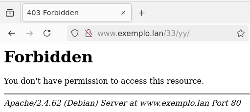
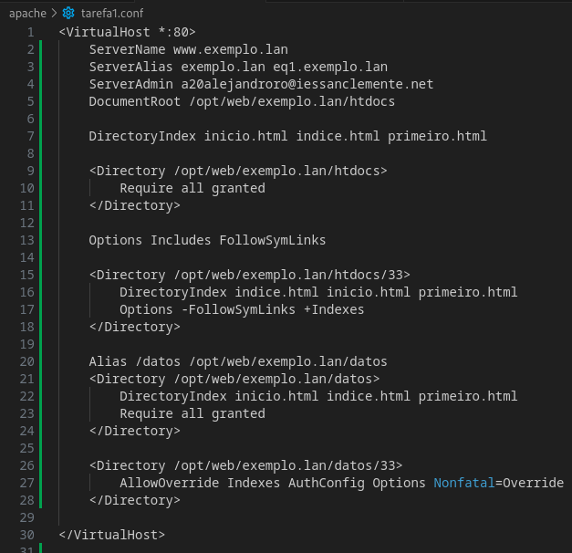

## Enunciado

Necesitamos ter un nome DNS válido que apunte ao enderezo IP da nosa máquina.  Nesta tarefa, supoñemos que o nome do dominio é equipo.lan, pero necesitarás adaptar ao teu nome DNS.

Configuramos un servidor virtual para www.exemplo.lan (e que tamén responda para exemplo.lan e eq1.exemplo.lan). monta o directorio exemplo.lan en  en /opt/web/exemplo.lan

Se empregas a máquina virtual de Google Cloud, elixte ti dous dos nomes que teñas ti configurado nun dos teus dominios.

A configuración para o sitio www.exemplo.lan debe ser a seguinte:

- O raíz de documentos debe ser /opt/web/exemplo.lan/htdocs. A orde de ficheiros de procura debe ser inicio.html, indice.html e primeiro.html por esta orde. Tendo en conta os ficheiros que hai no directorio raíz, indica que ficheiro se amosa accedendo a http://www.exemplo.lan/, http://www.exemplo.lan/11 e http://www.exemplo.lan/22 explicándoo brevemente, e pegando unha captura de pantalla desde o navegador dun cliente.

    - O ficheiro de configuración de apache:
   
    

    - Cambios no compose para que funcione:
   
    

    - Accedendo a http://www.exemplo.lan/ amosase o ficheiro **inicio.html** xa que e o primeiro que se indica na directiva de configuración "DirectoryIndex":
    
    

    - Accedendo a http://www.exemplo.lan/11 amosase o ficheiro **/11/indice.html** xa que é un dos ficheiros que se indican na directiva de configuración "DirectoyIndex":
    
    


    - Accedendo a http://www.exemplo.lan/22 non se amosa ningun ficheiro xa que no cartafol **/22** non existe ningun ficheiro dos indicados na directiva de configuración "DirectoryIndex":
   
    

- No host virtual queremos facer que se habiliten as inclusións desde o servidor e se sigan as ligazóns simbólicas. Para probalo, crea unha ligazón simbólica chamado “zz” ao directorio 33 (ámbolos dous dentro do directorio raíz de documentos. Ademais, queremos facer que no directorio 33 a orde de ficheiros de atopar cando se introduce na URL o nome dun directorio, sexa indice.html, inicio.html e primeiro.html. Amosa a configuración establecida e indica razoadamente que ficheiro se debería amosar accedendo a http://www.exemplo.lan/zz e http://www.exemplo.lan/33. Amosa unha captura de pantalla de cada un para demostralo.

    - O ficheiro de configuración de apache:
    
    

    Para crear o enlace simbolico:
    ```ln -s zz /opt/web/exemplo.lan/htdocs/33/```

    - Accedendo a http://www.exemplo.lan/33 amosa o ficheiro indice.html xa que é o primeiro ficheiro que se indica na directiva de configuracion "DirectoryIndex" do "<Directory /opt/web/exemplo.lan/htdocs/33 >"
    
    

    - Accedendo a http://www.exemplo.lan/zz amosa o contido do cartafol /33 xa que é un enlace simbolico porque se indica na directiva de configuracion "Options FollowSymLinks"
   
    

- No directorio 33 (dentro do raíz de documentos) queremos engadir a opción para amosar un listado do contido do directorio no caso de se introduza un directorio na URL e que non exista ningún dos ficheiros especificados anteriormente como de procura e tamén deshabilitar a opción de facer ligazóns simbólicas. Crea unha ligazón simbólica dentro dese directorio chamado yy con destino a 44 (dentro do raíz de documentos). Indica a configuración establecida, engade unha captura de pantalla e explica a saída producida para http://www.exemplo.lan/33/yy http://www.exemplo.lan/33/imaxes , http://www.exemplo.lan/44 e http://www.exemplo.lan/22

    - O ficheiro de configuración de apache:
    
    

    - Ao acceder a http://www.exemplo.lan/33/yy non vai porque se quitou a directiva dos enlaces simbolicos para o cartafol /33
   
    

    - Ao acceder a http://www.exemplo.lan/33/imaxes mostra o contido dese directorio porque non hay ningun dos ficheiros listados na directiva "DirectoryIndex"
   
    

    - Ao acceder a http://www.exemplo.lan/44 mostranos o contido pero facendo caso a configuración general ou a do VirtualHost, non ha do directorio /33
   
    

    - Ao acceder a http://www.exemplo.lan/22 e normal que non nos mostre nada, porque e o mesmo caso que o anterior e non esta activada a directiva "Indexes" na configuración general ou a do Virtual Host
   
    

- Indica como farías, sen alterar o sistema de ficheiros, para que cando accedamos a http://www.exemplo.lan/datos se acceda ao contido que exista dentro de /opt/web/exemplo.lan/datos. Amosa tamén unta captura de pantalla da URL anterior.
    
    - O ficheiro de configuración de apache:
   
    
    
    - Resultado de acceder a http://www.exemplo.lan/datos
    
    

- No directorio 50 (dentro da raíz de documentos), tamén queremos habilitar o traballo con ficheiros .htaccess, pero so queremos habilitar as opcións mínimas necesarias para facer o seguinte dentro dese directorio:

    - A orde de ficheiros a buscar debe ser un.html, dous.html e tres.html nesa orde, e no subdirectorio abc que está dentro de 50 a orde será tres.html, dous.html e un.html

    - No subdirectorio segredo non está permitido o acceso.

    - No subdirectorio imaxes queremos habilitar a opción para que cando non existan os ficheiros de procura se amose un listado co contido do directorio.

    - No caso de que se poña unha directiva non permitida, trataranse as directivas non permitidas coma non fatais

    - Ficheiro de configuración de apache:
    
     

    - Ficheiro ".htaccess" general, para todo o directorio /50:
   
     
   
    - Ficheiro ".htaccess" para o subdirectorio /50/abc:
   
     

   
    - Ficheiro ".htaccess" para o subdirectorio /50/imaxes:
  
     
   
    - Ficheiro ".htaccess" para o subdirectorio /50/segredo:
   
    

- Indica os cambios que habería que facer para non ter que poñer de forma explícita unha sección <Directory> para o mesmo directorio indicado pola directiva DocumentRoot, se todos os host virtuais estivesen aloxados dentro de /opt/web

    No ficheiro de configuración de apache se engadiria "Require all granted" fora de calquera <Directory>

- No mesmo suposto que esta tarefa, que pasaría se a directiva DirectoryIndex estivese dentro do directorio indicado coa directiva DocumentRoot?

    Que non mostraría nada, xa que non existe ningun ficheiro indicado no DirectoryIndex que se corresponda en "/opt/web".

- Que pasa se poñemos un ficheiro .htaccess no directorio do DocumentRoot?

    Non mostraria nada se non se activa a directiva "AllowOverride"

- Que pasaría se no directorio 50 non existisen os ficheiros un.html, dous.html e tres.html

    Non mostraría nada xa que non se corresponderia cos indicados na directiva "DirectoryIndex" dentro do ficheiro .htaccess

- Que pasaría se nun ficheiro .htaccess no directorio 50 se introduce unha directiva non permitida, coma por exemplo ErrorDocument?.

    Pois que aplicaria a opcion Nonfatal=Override da directiva AllowOverride, é decir, trataria as directivas non permitidas como non fatais, incluida esta.

- Como farías para configurar os 4 primeiros puntos con ficheiros .htaccess. Amosa a configuración resultante do host virtual, e o contido e localización dos ficheiros `.htaccess`

    Simplemente teria que habilitar a directiva AllowOverride coas suas opcions dentro de cada <Directory> e despois iria creando os ".htaccess" en cada directorio correspondente que conterian as demais configuracións que se pidan.
